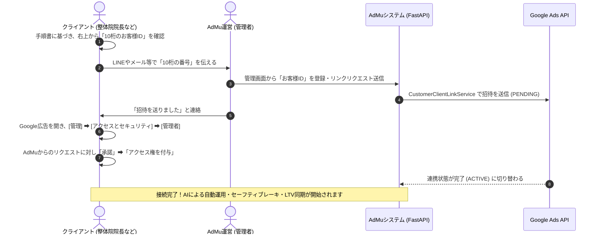

# AdMu Google広告統合＆外販準備完了ナレッジ（2026年6月9日）

AdMu（アダム）の整体院向け外販リリースに向けた最終改修、API実環境疎通テスト、および初心者向けオンボーディング手順の策定結果をまとめたナレッジドキュメントです。

---

## 1. 完了した実装と機能概要

これまでに指摘された「実運用上の弱点」を解決するため、以下の機能を実装し本番デプロイを完了しました。

### ① 予算変更の実Google広告APIへの即時同期
*   **内容:** 管理画面での日予算変更（AI配分、手動割合配分、個別日予算設定）が、DB更新と同時に実際のGoogle広告（`CampaignBudgetService`）へ即時反映（mutate）される仕組みを構築。

### ② 月間予算オーバー防止のための自動セーフティブレーキ
*   **内容:** `monitor.py` による5分ごとの定期スキャンにおいて、該当店舗の当月総コスト（`get_this_month_cost`）が設定された月予算上限に達した際、稼働中の全キャンペーンを自動的に `PAUSED`（一時停止）に同期し、ローカルDBのステータスも更新。さらに運営および店舗オーナー宛に「LINE」と「メール」で緊急停止の通知を送信。

### ③ LTVデータの自動定期同期（AI Feed Guard）
*   **内容:** 毎日深夜3:00に自動実行される `_run_auto_ltv_upload_scan` ジョブをスケジューラーに追加。Logictionの患者データから、GCLIDが紐付きかつLTVが1円以上発生している最新レコードを抽出して、Google広告へオフラインコンバージョン値としてPushアップロードする処理を完全自動化。

---

## 2. API疎通確認と検証結果

本番環境（実API）での疎通テスト、および連携処理が正常に動作することを検証済みです。

### 🚨 Google Ads API 昇格審査（Basic Access）
*   **ステータス:** **承認済み（完了）**
*   **検証:** 本番のデベロッパートークンを使用した実疎通テストプログラム（`check_api_status.py`）を実行した結果、無事にGoogle広告アカウント（`AdMuシステム管理`）の取得に成功（`✅ API 疎通OK！`）。未承認エラー（`DEVELOPER_TOKEN_NOT_APPROVED`）が出ないことを確認しました。

### 🔌 オンボーディング（リンクリクエスト）実疎通テスト
*   **検証:** 実API接続状態で、ダミーの10桁ID（`999-999-9999`）宛てに招待（リンクリクエスト）を送信するテストを走らせた結果、GoogleのAPIサーバーから期待通りのエラー応答（`RESOURCE_NOT_FOUND`）をgRPC経由で受信しました。
*   **結論:** 認証情報および招待送信ロジックが本物として完璧に機能していることが立証されました。実在するクライアントのIDで送信すれば、問題なくGoogle広告側へ招待が届く状態です。

---

## 3. 本番デプロイとインフラステータス

*   **GitHub同期:** 最新の変更（実装コード、初心者向け手順書）はすべてリモートリポジトリ（`origin/main`）にPush済みです。
*   **Renderデプロイ:** Renderの自動ビルドにより最新の変更がデプロイされ、ヘルスチェック（`/health`）も正常に応答（`db_status: connected` / PostgreSQL連携確認）しています。
*   **商用インフラ:** RenderのWebサーバーおよびPostgreSQLデータベースは共に有料プラン（常時起動、データベースの90日削除制限なし）へ移行済み。Stripeの本番決済テストも正常完了しています。

---

## 4. 今後の運用・オンボーディングフロー

外販時の具体的なクライアント連携フローは以下の通りです。

*   **初心者用手順書:** [GoogleAds_Onboarding_Guide.md](file:///Users/ishikawagai/Desktop/整体院導/AdMu/docs/GoogleAds_Onboarding_Guide.md)
