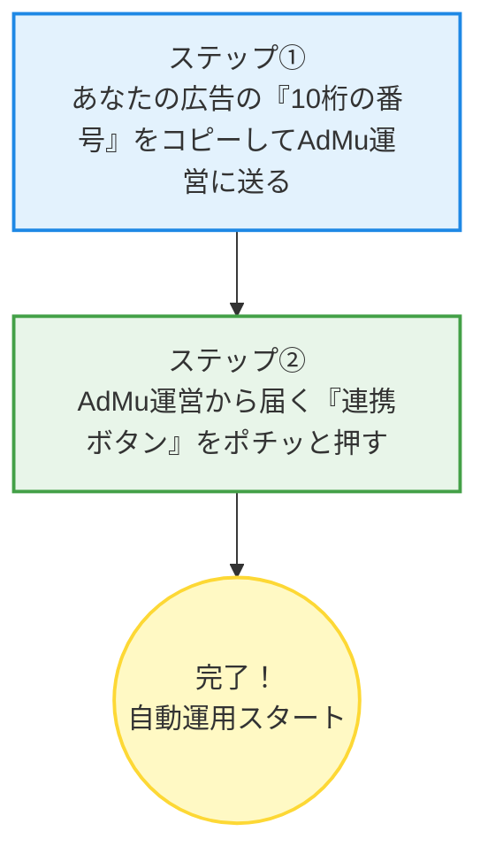

# 【かんたん解説】Google広告アカウントをAdMu（アダム）と連携する手順書

本手順書は、パソコンやITの操作が苦手な整体院のオーナー様・スタッフ様向けのマニュアルです。
専門用語をなるべく使わずに、ステップバイステップで説明しています。

---

## 🌟 今回行うことのイメージ
あなたの整体院の「Google広告アカウント」と、自動運用システムである「AdMu」を繋ぐ作業です。
作業は大きく分けて**２つのステップ**だけです。



---

## 📍 ステップ①：自分の「10桁の番号」を確認して送る

まずは、あなたのGoogle広告アカウントを特定するための「10桁の番号（お客様ID）」をAdMu運営にお知らせください。

### 【操作手順】
1. **Google広告のページを開きます**
   * 下のリンクをクリックして、Google広告にアクセスします。
   * 👉 [Google広告 ログイン画面 (https://ads.google.com)](https://ads.google.com)
   * ※画面右上の **「ログイン」** ボタンから、いつもお使いのGoogleアカウント（Gmailアドレス）でログインしてください。

2. **画面右上にある「10桁の番号」を見つけます**
   * ログインすると、画面の右上（あなたのアイコンの近く）に、**「123-456-7890」** のようなハイフンで区切られた10桁の番号が表示されています。
   * 下の図の赤枠の部分です。

   ```
   +-------------------------------------------------------------+
   |  Google広告   [検索...]             (問合せ) (通知) [123-456-7890] | 👤
   +-------------------------------------------------------------+
                                                         ▲
                                               この「10桁の数字」です！
   ```

3. **この番号をコピーして、AdMu運営に送ります**
   * この10桁の番号（例：`123-456-7890`）をそのままコピーするか、手書きでメモしてください。
   * LINEやメールなどで、AdMu運営宛てに**「私たちの10桁の番号は 123-456-7890 です」**とお送りください。

---

## 📍 ステップ②：AdMu運営からの「連携リクエスト」を承認する

あなたが送ってくださった10桁の番号を元に、AdMu運営側から「あなたの広告アカウントと繋いでも良いですか？」という申請（リクエスト）をお送りします。
運営から「リクエストを送信しました」と連絡がありましたら、以下の手順で承認（OK）をしてください。

### 【操作手順】
1. **Google広告のページをもう一度開きます**
   * 👉 [Google広告 ログイン画面 (https://ads.google.com)](https://ads.google.com) にログインします。

2. **「アクセスとセキュリティ」画面を開きます**
   * 画面の左側にあるメニューから、歯車のマークの **「管理」** をクリックします。
   * 表示されたメニューの中から、**「アクセスとセキュリティ」** をクリックします。

   ```
   【画面左メニューのイメージ】
   +----------+
   | 📊 概要  |
   | 📈 キャンペーン
   |   ...    |
   | ⚙️ 管理   <-- ① ここをクリック！
   |   +-- アカウント設定
   |   +-- アクセスとセキュリティ <-- ② 次にここをクリック！
   +----------+
   ```
   *(※古い画面デザインをお使いの場合は、画面上の「ツールと設定」➡「アクセスとセキュリティ」の順にクリックしてください)*

3. **「管理者」タブを開きます**
   * 画面の上にいくつかタブ（切り替えボタン）が並んでいます。
   * その中から、**「管理者（Managers）」** というタブをクリックします。

   ```
   【アクセスとセキュリティ画面の上部】
   +------------------------------------------------------+
   |  [ユーザー]   [管理者]  <-- ★ここをクリック！   [セキュリティ] |
   +------------------------------------------------------+
   ```

4. **届いている申請を「承諾」します**
   * 画面の表の中に、**「AdMuシステム管理」**（または運営から指定された名前）からのリクエストが届いています。
   * 右側にある青いボタンの **「承諾（Accept）」** をクリックします。

   ```
   【届いているリクエスト一覧のイメージ】
   +-------------------+--------------+---------------+------------+
   | リクエスト送信元  | 権限レベル   | 送信日        | アクション |
   +-------------------+--------------+---------------+------------+
   | AdMuシステム管理  | 管理者       | 2026年6月9日  | [ 承諾 ]   <-- これを押す！
   +-------------------+--------------+---------------+------------+
   ```

5. **最後に「アクセス権を付与」を押して完了です**
   * 承諾を押すと、「アクセス権を付与しますか？」という確認画面（ポップアップ）が表示されます。
   * **「アクセス権を付与」**（または「許可」）ボタンをクリックします。

---

## 🎉 これで作業はすべて完了です！
これで、あなたのGoogle広告アカウントとAdMuシステムの連携が完了しました。
自動運用AIが、あなたの店舗の広告を最適化し始めます。

### ❓ うまくいかないときのQ&A

*   **Q. 画面右上にお客様ID（10桁の番号）が表示されません**
    *   **A.** 画面の右上にある「👤（人のアイコン）」をクリックしてみてください。アカウント名のすぐ下に10桁の番号が表示されます。
*   **Q. 「アクセスとセキュリティ」という項目が見つかりません**
    *   **A.** Google広告の画面デザインによって場所が少し異なる場合があります。見つからない場合は、画面の上部にある「検索窓（虫眼鏡マーク）」に **「アクセスとセキュリティ」** と入力して検索してみてください。
*   **Q. 「管理者」タブに申請が届いていません**
    *   **A.** AdMu運営側での手続きがまだ完了していない可能性があります。「10桁の番号を送ったのに届いていない」旨を運営にご連絡ください。
